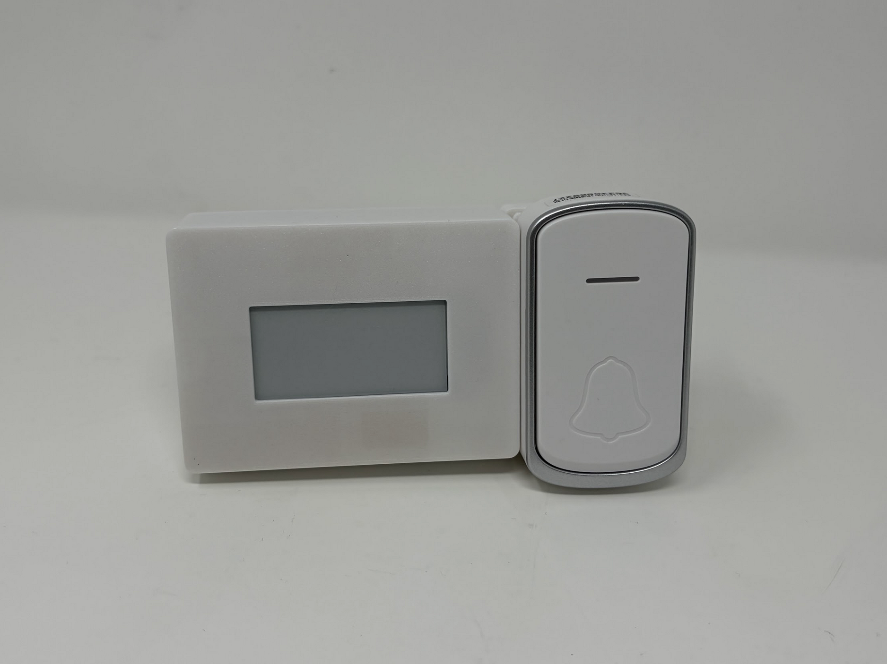
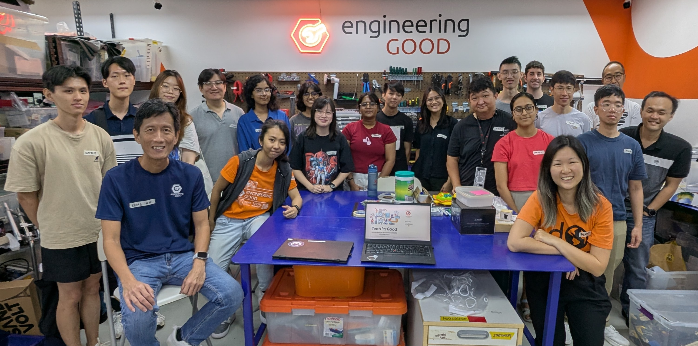

# Visual Doorbell

An open-source visual alert doorbell system designed to support isolated seniors and individuals with partial or full hearing loss. This project augments an off-the-shelf wireless doorbell with an acknowledgement button and a responsive e-paper display to facilitate simple, accessible communication with visitors.

The device is comprised of off-the-shelf electronics and 3D printed parts. The total cost of materials is about $40 USD (excluding component shipping fees and 3D printed parts).

## About the Project

**Who is this for?**

Isolated individuals living in public rental flats or alone, especially those who:

- Have partial or full hearing loss.
- Move slowly due to age or mobility impairments.
- Rely on community support.

**What does it do?**

1. Provides a clear visual indication inside the home when the doorbell is pressed.
2. Features an exterior e-paper display that informs visitors (e.g., displaying "I'm coming" when acknowledged by the resident).

## Features

- **Low-Power Operation:** The ESP32-C6 MCU remains in deep-sleep mode during idle periods and is woken by a hardware interrupt only when triggered, maximizing battery life.
- **No Wi-Fi/Internet Required:** Operates entirely independently of cloud services, utilizing local wired connections and 433 MHz RF communication for rock-solid reliability.
- **Accessible Notifications:** High-contrast e-paper displays and visual light indicators make it highly suitable for the hearing impaired.
- **Simple Interaction:** Uses a minimal two-button interface (one for the visitor, one for the user) to eliminate steep learning curves.

## System Architecture

The system is divided into two functional subsystems:

1. **Inform User (Indoor):** When a visitor presses the outdoor doorbell, an indoor indicator light activates.
2. **Inform Visitor (Outdoor):** If the user is home and presses their indoor acknowledge button, a 433 MHz wireless signal is transmitted to the outdoor RF module. The ESP32-C6 wakes up and updates the E-Paper display to let the visitor know the user is on their way to the door.

## How to Obtain the Device

### 1. Do-it-Yourself (DIY) or Do-it-Together (DIT)

This is an open-source assistive technology, so anyone is free to build it. All of the files and instructions required to build the device are contained within this repository. Refer to the Maker Guide below.

### 2. Get Involved: Requests & Volunteering

- Need this device? If you or someone you know could benefit from the Visual Doorbell, please send us an email at [contactus@engineeringgood.org](mailto:contactus@engineeringgood.org). We also invite you to share your journey with us! Tell us your stories about the device and feedback help us make our assistive tech even better!

- Want to help? We are always looking for volunteers to help build these devices for the community. If you have the skills and want to contribute, please contact us via email at [contactus@engineeringgood.org](mailto:contactus@engineeringgood.org).

## Build Instructions

### 1. Read through the Maker Guide

The [Maker Guide](/documentation/Product_Manual_Template_Product_Name.pdf)  contains all the necessary information to build this device, including tool lists, assembly instructions, and testing.

### 2. Order the Off-The-Shelf Components

The [Bill of Materials](/documentation/Template_BOM.csv) lists all of the parts and components required to build the Template Device.

### 3. Assemble the Template Device

Reference the Assembly Guide section of the [Maker Guide](/documentation/Product_Manual_Template_Product_Name.pdf) for the tools and steps required to build each portion.

## How to improve this Device

As open source assistive technology, you are welcomed and encouraged to improve upon the design.

## Files

### Documentation

| Document             | Version | Link |
|----------------------|---------|------|
| Maker Guide          | 1.0     | [Template_Maker_Guide](/documentation/Product_Manual_Template_Product_Name.pdf)     |
| Bill of Materials    | 1.0     | [Template_Bill_of_Materials](/documentation/Template_BOM.csv)     |
| User Guide           | 1.0     | [Template_User_Guide](/documentation/Product_Manual_Template_Product_Name.pdf)    |
| Changelog            | 1.0     | [Template_Change_Log](/documentation/CHANGES.txt)     |

## Open Source Attribution

This documentation template was created by Makers Making Change / Neil Squire Society and is used under a CC BY-SA 4.0 license. It is available at the following link: [MMC OpenAt Template](https://github.com/makersmakingchange/OpenAT-Template)

## Copyright & License

Copyright 2026 Engineering Good.

This repository contains open source hardware:

- Everything needed or used to design, make, test, or prepare the Visual Doorbell is licensed under the [Apache 2.0 License](https://www.apache.org/licenses/LICENSE-2.0).
- Accompanying material such as instruction manuals, videos, and other copyrightable works that are useful but not necessary to design, make, test, or prepare the Visual Doorbell are published under a [Creative Commons Attribution-ShareAlike 4.0 license (CC BY-SA 4.0)](https://creativecommons.org/licenses/by-sa/4.0/).

Source Location: <https://github.com/Engineering-Good/T4G-Visual-Doorbell>

----

<!-- ABOUT EG START -->
## About Engineering Good

- Website: [https://www.engineeringgood.org](https://www.engineeringgood.org)
- GitHub: [Engineering-Good](https://github.com/Engineering-Good)
- Instagram: [@engineeringgood](https://www.instagram.com/engineeringgood/)
- Facebook: [engineeringgood](https://www.facebook.com/engineeringgood.org/)
- LinkedIn: [engineeringgood](https://www.linkedin.com/company/engineeringgood/?originalSubdomain=sg)
- Thingiverse: [engineeringgood](https://www.thingiverse.com/engineeringgood/designs)
- Printables: [@engineeringg_4351657](https://www.printables.com/@engineeringg_4351657)

### Contact Us

For technical or non-techical questions, to get involved, or to share your experience we encourage you to

- Visit [our website](https://www.engineeringgood.org/)
- Contact us via our [contact us form](https://www.engineeringgood.org/contact-faq/)
- Email us at [contactus@engineeringgood.org](mailto:contactus@engineeringgood.org)
<!-- ABOUT EG END -->
